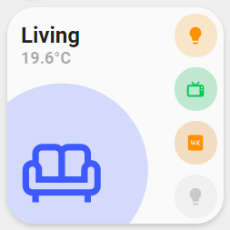

### Room

> NOTE
> This card is under active development and is not ready to use!



<details>
<summary>Usage</summary>

#### Example

```yaml
- type: 'custom:button-card'
  template:
    - card_room
    - blue
  entity: climate.vicare_heating
  name: Living
  icon: mdi:sofa-outline
```

#### Variables
<table>
<tr>
<th>Variable</th>
<th>Example</th>
<th>Required</th>
<th>Explanation</th>
</tr>
<tr>
<td></td>
<td></td>
<td></td>
<td></td>
</tr>
</table>
<br />
</details>

#### Code
Template can be found [here](./custom_card_room.yaml)
